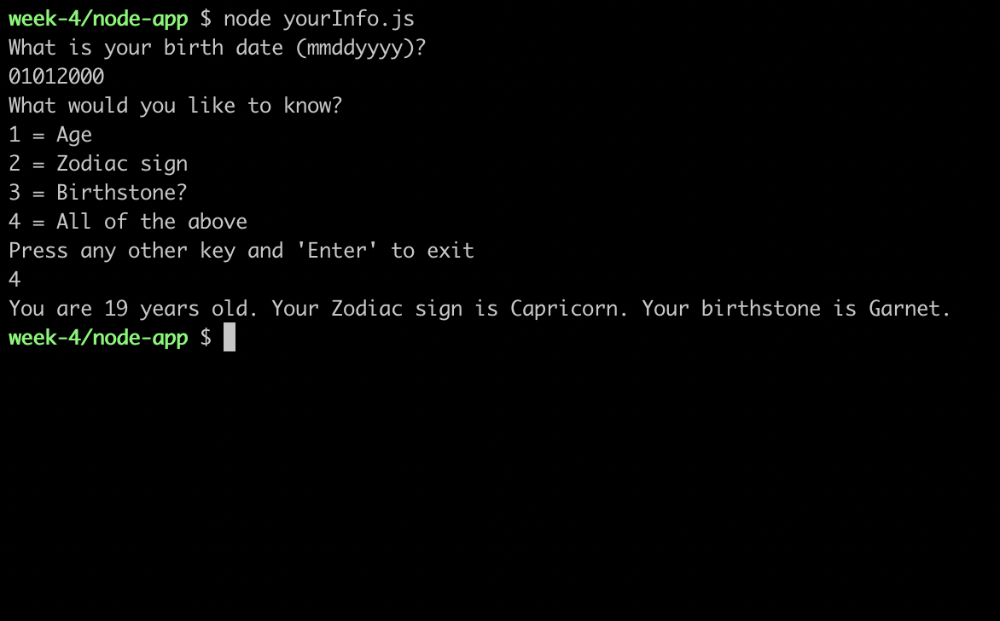

# yourInfo
yourInfo takes in a user's birth date in MMDDYYYY format and gives the user the option of seeing their age, Zodiac sign, birthstone, or all previous items at once. 

Here is an example:

